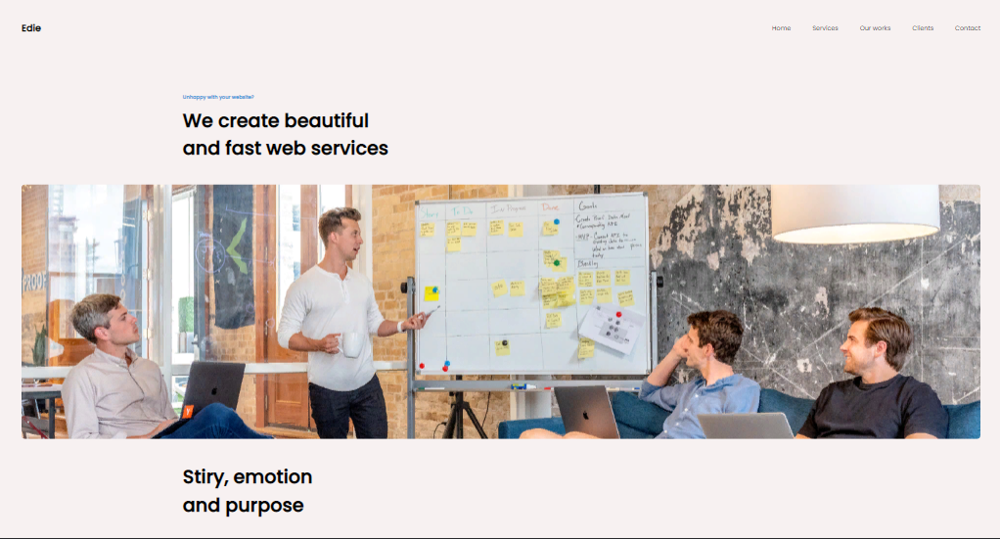
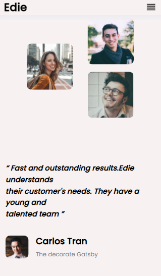
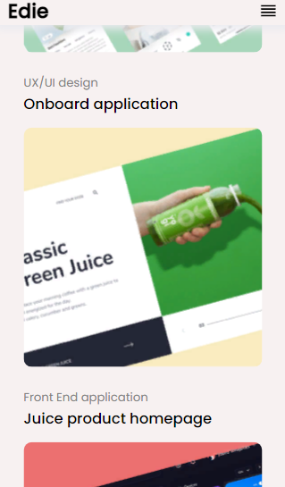

<h1 align="center">Edies homepage</h1>

<div align="center">
   Solution for a challenge from  <a href="http://devchallenges.io" target="_blank">Devchallenges.io</a>.
</div>


<div align="center">
  <h3>
    <a href="https://jorgeduranalcala.github.io/Edies-homepage/">
      Demo
    </a>
    <span> | </span>
    <a href="https://github.com/JorgeDuranAlcala/Edies-homepage">
      Solution
    </a>
    <span> | </span>
    <a href="https://devchallenges.io/challenges/xobQBuf8zWWmiYMIAZe0">
      Challenge
    </a>
  </h3>
</div>

<!-- TABLE OF CONTENTS -->

## Table of Contents

- [Overview](#overview)
  - [Built With](#built-with)
- [Features](#features)
- [How to use](#how-to-use)
- [Contact](#contact)
- [Acknowledgements](#acknowledgements)

<!-- OVERVIEW -->

## Overview

 ### Desktop version

 
 ### Mobile version





### Built With

<!-- This section should list any major frameworks that you built your project using. Here are a few examples.-->

- CSS
- HTML

## Features

<!-- List the features of your application or follow the template. Don't share the figma file here :) -->

This application/site was created as a submission to a [DevChallenges](https://devchallenges.io/challenges) challenge. The [challenge](https://devchallenges.io/challenges/xobQBuf8zWWmiYMIAZe0) was to build an application to complete the following user stories:

- [x] User story: I can see a page following the given design
- [x] User story: I can see a page on mobile following the given design
- [x] User story: I can go to certain locations by selecting links in navigation or footer

## How To Use

To clone and run this application, you'll need [Git](https://git-scm.com) installed on your computer. From your command line:

```bash
# Clone this repository
$ git clone https://github.com/JorgeDuranAlcala/Edies-homepage.git

```

## Acknowledgements

<!-- This section should list any articles or add-ons/plugins that helps you to complete the project. This is optional but it will help you in the future. For exmpale -->

- [Steps to replicate a design with only HTML and CSS](https://devchallenges-blogs.web.app/how-to-replicate-design/)
- [Marked - a markdown parser](https://github.com/chjj/marked)

## Contact

- Website [my-website](https://portfolio-3g11gvtol-jorgeduranalcala.vercel.app/)
- GitHub [my-github](https://github.com/JorgeDuranAlcala)
- Twitter [my-twitter](@JorgeDuCala)